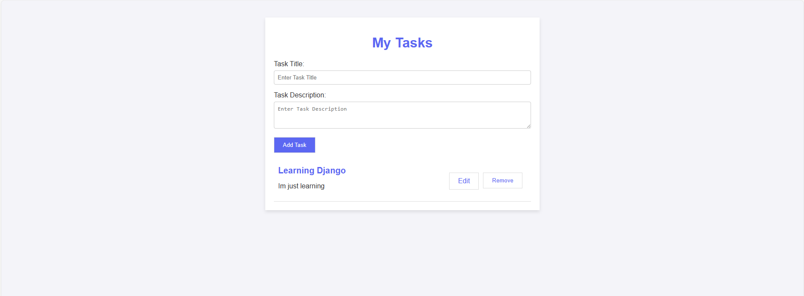

# To Do App

## About

This project aims to enhance Django skills, focusing on teaching back-end concepts to beginners.

## Layout

## Technologies Used

- Python
- Django
- JavaScript (opcional)
- HTML
- CSS

## How to Use

1. Clone the repository:

https://github.com/LucasSobrinh0/todo_app

2. Database:

python manage.py makemigrations

python manage.py migrate

3. Install the dependencies:

pip install -r requirements.txt

4. Run the server:

python manage.py runserver

## Author

Lucas Sobrinho Carneiro

Linkedin: https://www.linkedin.com/in/lucas-sobrinho-c-b9b6661b9/

Email: lucas.sobrinho.crn@gmail.com
